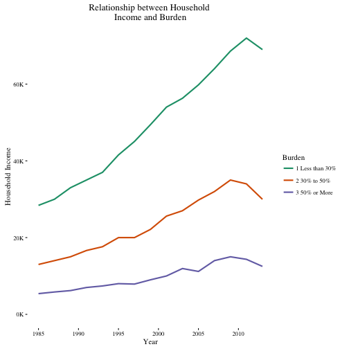
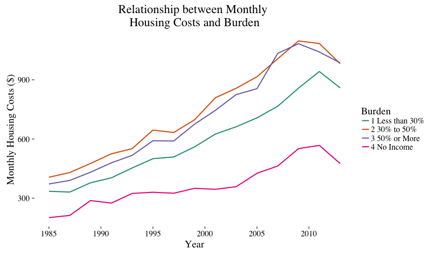
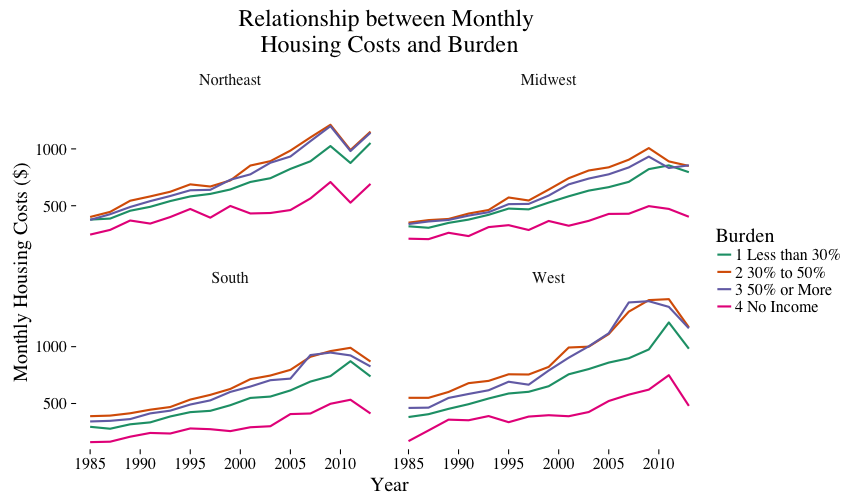
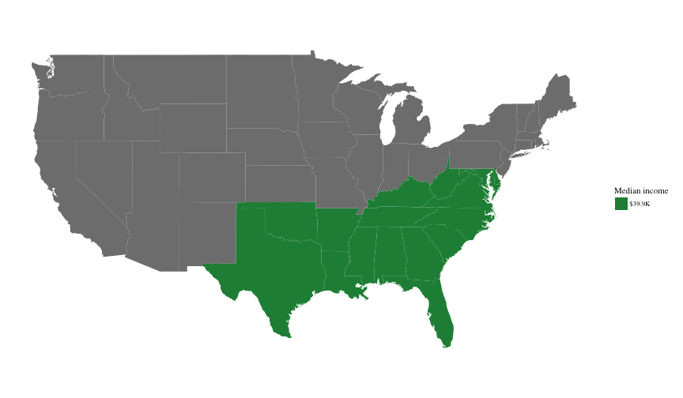
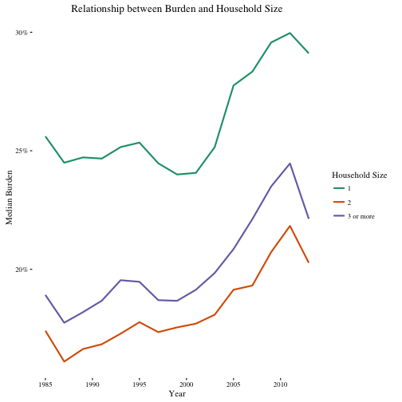
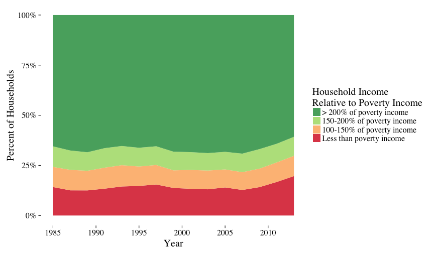
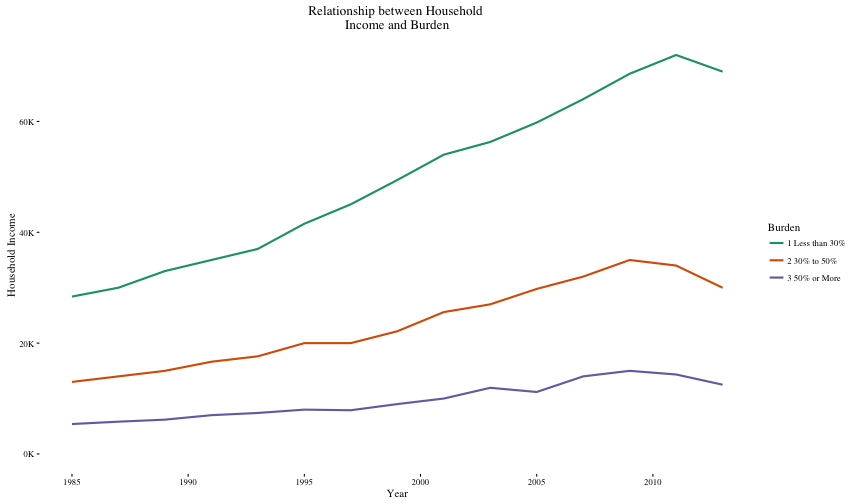
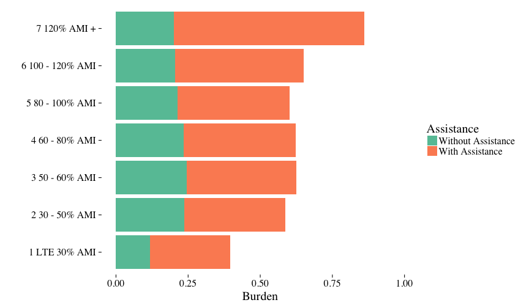
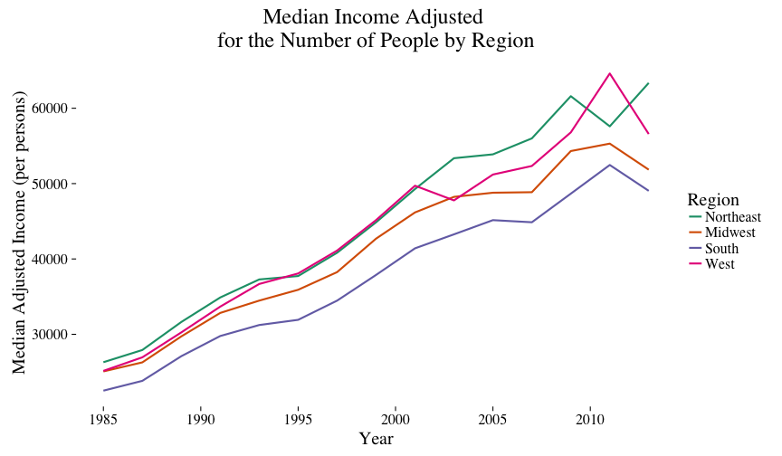
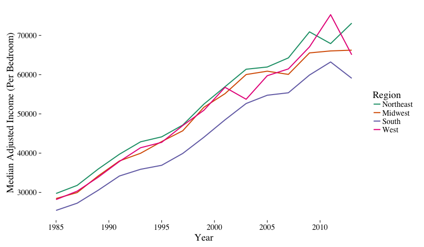

## Introduction: Motivation and Dataset

* Our data extends from 

* William's cleaning
* Sri's cleaning
* Plots
* Conclusion stuff

---

## Cleaning the Data

Combined Years:

- Dataset is split into fifteen datasets, one for each odd year between 1985 and 2013
- To standardize the data used data from 2003 - 2013
- Reorder the columns to exactly match that of our base (2003 onward)
- Combine every list of datasets into single dataset

Clean Data:

- Initally removed NAs, expressed column in read_csv
- Set column names to lowercase, removed quotations
- Created column for owning and renting data (1= own, 2= rent)
- Write to csv (same for combined years)

---

## Variables According to the HUD Document Data Set 

Variables  | Meanings
---------- | --------
Burden | Household’s monthly housing cost divided by its monthly income
Per | Household Size 
ABLMED | Median Income Adjusted for # of Bedrooms
APLMED | Median Income Adjusted for # of Persons
ZSMHC | Monthly housing costs
ZINC2 | Household Income
Assisted | Asssisted Housing
Year | The Year of the Data
Region | Census Region
fmtincrelpovcat |HH Income Relative to Poverty Income 
fmtstructuretype | Structure Type
increlamipct | HH Income relative to AMI (Percent)
fmtcostmedrelamicat | CostMed Relative to Median Income 

---

## Household Income and Burden

---

## Monthly Housing Costs and Burden 

---

## Regional Monthly Housing Costs and Burden

---

## Median Income Among Differing Census Regions in 2013

--- 

## Household Size and Burden

---

## Households and Poverty 

---

## Income Compared to Area's Median by House TypeS

---

## Burden Based on Median Housing Cost with Assistance

---

## MORE GRAPHS

- Adjusted income per persons
- Bracketed by HUD indexes (0.70 for 1 person, 0.80 for 2, 1.00 for 4)
- Spike around 2010 associated with financial crisis

---

## Median Income Adjusted for Number of Bedrooms By Region

Adjusted income per bedroom

Bracketedby HUD indexes (0.70 for 0, 0.90 for 2, 1.04 for 3)

More discrepancy in burden levels between the Midwest/South and Northeast/West 
  
  - Larger homes in the Midwest/South

Purhasing parity shoudl be higher in midwest/south, not expressed in data

---

## Concluding Thoughts

Housing Affordability Has Decreased

The 2007 Housing Bubble Crisis and it's Consequences

Census Regions Differences 
  
  - Western and Northeast Regions Vs. South and Midwest

---

## Future Questions 

* Does the Data in some graphs keep showing a downward slope? 

* If we analyzed data from 2013 - 2016, would it show another potential, housing housing bubble?

* Our data is limited to 2013, so what is the housing situation most recently?

---

## Ask Us Anything

---
