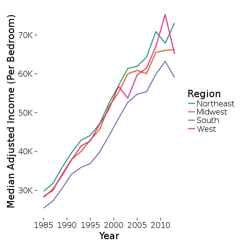

## Introduction: Motivation and Dataset

- Data is chosen from the American Housing Survey (1985 - 2013)

- Burden = Housing Cost Over Monthly Income
  
  - Households with zero/negative income have "-1" in data

- Goal: Housing Affordability 

- Hypothesis: Affordability decreased due to key significant events 
 
- US growing income inequality is indicator of:
  - Housing affordability
  - Shifting income brackets poor and rich
  
- 2007 Housing Market Crash

---

## Cleaning the Data

Combined Years:

- Dataset is split into fifteen datasets, one for each odd year between 1985 and 2013
- To standardize the data used data from 2003 - 2013
- Reorder the columns to exactly match that of our base (2003 onward)
- Combine every list of datasets into single dataset

Clean Data:

- Initally removed NAs, expressed column in read_csv
- Set column names to lowercase, removed quotations
- Created column for owning and renting data (1= own, 2= rent)
- Write to csv (same for combined years)

---

## Variables According to the HUD Document Data Set 

Variables  | Meanings
---------- | --------
Burden | Household’s monthly housing cost divided by its monthly income
Per | Household Size 
ABLMED | Median Income Adjusted for # of Bedrooms
APLMED | Median Income Adjusted for # of Persons
ZSMHC | Monthly housing costs
ZINC2 | Household Income
Assisted | Asssisted Housing
Year | The Year of the Data
Region | Census Region
fmtincrelpovcat |HH Income Relative to Poverty Income 
fmtstructuretype | Structure Type
increlamipct | HH Income relative to AMI (Percent)
fmtcostmedrelamicat | CostMed Relative to Median Income 
AMI | Area median income 

---

## Household Income and Burden

---

## Monthly Housing Costs and Burden 

- No Income Bracket
  - Not paying for costs
  - Paying with trust funds
- Similar housing costs among burden brackets

---

## Regional Monthly Housing Costs and Burden

- The Northeast impacted first
  - Other regions lagged by two years

---

## Median Income by Census Regions in 2013

--- 

## Household Size and Burden

---

## Households Relative to the Poverty Line 

---

## Income of Median Area by House Types

---

## Burden and Median Housing Cost with Assistance

- Those needing assitance with reducment of total salary
  - Unemployment 
  - Monetary Crisis 
- High cost brackets = Higher burdens with assistance 
- Less mobility for single families 

---

## Median Income Adjusted by Region

- Adjusted income per persons
- Bracketed by HUD indexes (0.70 = 1 person, 0.80 = 2, 1.00 = 4)
- Spike around 2010

--- &twocol

## Median Income Adjusted for Bedrooms By Region

*** =left

*** =right

- Bracketedby HUD indexes 
  
  - (0.70 for 0, 0.90 for 2, 1.04 for 3)
  
- More discrepancy in burden levels between regions 
  
  - Larger homes in Midwest/South
  
- Purchasing parity higher in midwest/south

---

## Concluding Thoughts

- Housing Affordability Has Decreased

- The 2007 Housing Bubble Crisis and it's Consequences

- Census Regions Differences 

  - Western and Northeast Regions Vs. South and Midwest
  
## Future Questions / Ask Us Anything

- Do these graphs continue to have decreasing slopes 2014 - Present? 

- If we analyzed data from 2013 - 2016, would it show another potential, housing bubble?

---

## Ask Us Anything

